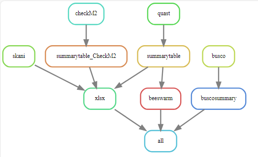

# Assembly QC pipeline
Marie Hannaert\
ILVO

Assembly QC pipeline is a pipeline to perform a quality control on assemblies of bacterial genomes.
This repository is a snakemake workflow that can be used to analyze assemblies specific for bacterial genomes. Everything needed can be found in this repository. I made this pipeline during my traineeship at ILVO-Plant. 

## Installing the assembly QC pipeline
Snakemake is a workflow management system that helps to create and execute data processing pipelines. It requires Python 3 and can be most easily installed via the bioconda package.

### Installing Mamba
The first step to installing Mamba is installing Miniforge:
#### Unix-like platforms (Mac OS & Linux)
````
$ curl -L -O "https://github.com/conda-forge/miniforge/releases/latest/download/Miniforge3-$(uname)-$(uname -m).sh"
$ bash Miniforge3-$(uname)-$(uname -m).sh
````
or 
````
$ wget "https://github.com/conda-forge/miniforge/releases/latest/download/Miniforge3-$(uname)-$(uname -m).sh"
$ bash Miniforge3-$(uname)-$(uname -m).sh
````
If this worked the installation of Mamba is done, if this didn't work you can check the documentation of Miniforge with the following link:
[MiniForge](https://github.com/conda-forge/miniforge#mambaforge)

### Installing Bioconda 
Then perform a one-time set up of Bioconda with the following commands. This will modify your ~/.condarc file:
````
$ mamba config --add channels defaults
$ mamba config --add channels bioconda
$ mamba config --add channels conda-forge
$ mamba config --set channel_priority strict
````
When you followed these steps Bioconda normally is installed, when it still doesn't work you can check the documentation with the following link: [Bioconda](https://bioconda.github.io/)
### Installing Snakemake 
Now creating the Snakemake enviroment, we will do this by creating a snakemake mamba enviroment:
````
$ mamba create -c conda-forge -c bioconda -n snakemake snakemake
````
If this was succesfull you can now use the following commands for activation and for help: 
````
$ mamba activate snakemake
$ snakemake --help
````
To check the documentation of Snakemake you can use the following link: [Snakemake](https://snakemake.readthedocs.io/en/stable/getting_started/installation.html)

### Downloading the assembly QC pipeline from Github
When you want to use the assembly QC pipeline, you can download the complete pipeline, including: scripts, conda enviroments, ... on your own local maching. Good practise is to make a directory **Snakemake/** where you can collect all of your pipelines. Downloading the assembly QC pipeline in your snakemake directory can be done by the following command: 
````
$ cd Snakemake/ 
$ git clone https://github.com/MarieHannaert/Long-read_Snakemake.git
````
### Making the database that is used for skANI
For using skANI you need to have a database, you can create one according to the following link: 
[Creating a database for skANI](https://github.com/bluenote-1577/skani/wiki/Tutorial:-setting-up-the-GTDB-genome-database-to-search-against)

When your database is installed you need to changed this path to the database in the Snakefile **Snakemake/Assembly_QC_Snakemake/Snakefile**, line 155. 

### Preparing checkM
Before you can run the pipeline you need activate checkm_data. 
````
$ conda activate .snakemake/conda/fc1c0b2ff8156a2c81f4d97546659744_ #This path can differ from yours
$ mkdir checkm_data
$ cd checkm_data
$ wget https://data.ace.uq.edu.au/public/CheckM_databases/checkm_data_2015_01_16.tar.gz
$ tar -xvzf checkm_data_2015_01_16.tar.gz 
$ rm checkm_data_2015_01_16.tar.gz 
$ cd ..
$ export CHECKM_DATA_PATH=<your own path>/snakemake/QCpipeline/checkm_data/
$ checkm data setRoot <your own path>/snakemake/QCpipeline/checkm_data/
````
When you did this you can check if this work by running:
````
$ checkm test ~/checkm_test_results
````
### Preparing checkM2
Here you also need to download the diamond database. 
This can be done by the following steps: 
````
$ conda activate .snakemake/conda/5e00f98a73e68467497de6f423dfb41e_ #This path can differ from mine
$ checkm2 database --download
$ checkm2 testrun
````

Now the snakemake enviroment is ready for use with the pipeline. 

## Executing the assembly QC pipeline 
Before you can execute this pipeline you need to perform a couple of preparing steps. 
### Preparing
In the **Assembly_QC_Snakemake/** you need to make the following directories: **data/assemblies**
````
$ cd Assembly_QC_Snakemake/
$ mkdir data/assemblies
````
In the assemblies directory you need to place the assemblies that you want to analyse. They must look like the following two assemblies:
- sample1.fna
- sample2.fna

#### Making scripts executable 
To make the scripts executable you need to run the following command in the **Snakemake/Assembly_QC_Snakemake/** :
````
$ chmod +x scripts/*
````
This is needed because otherwise the scripts that are used in the pipeline cannot be executed. 

#### Personalize genomesize
The genomesize is hardcoded in multiple lines. you need to change this to your genomesize. 
The lines in the Snakefile were you need to change this are:
- line 53
- line 109

## Executing the assembly QC pipeline
Now everything is ready to run the pipeline. 
If you want to run the pipeline without any output, just checking it it works, you can use the following command in the **Assembly_QC_Snakemake/**: 
````
$ snakemake -np
````
Now you will get an overview of all the steps in the pipeline. 

If you want to execute the pipeline and your assemblies are place in the **data/assemblies** directory, you can use the following command: 
````
$ snakemake -j 4
````
The -j option is needed when you work on a local server, this defines the number of treads that will be used to perform the pipeline, so you can chose the number yourself. 

### Pipeline content
The pipeline has five big steps. Besides these steps there are some side steps to make summaries and visualisations. 

#### skANI
skANI is a program for calculating average nucleotide identity (ANI) from DNA sequences (contigs/MAGs/genomes) for ANI > ~80%.
The output of skANI is a summary file: **skani_results_file.txt**, this info will be put in a xlsx file togheter with Quast summary file. 

SkANI documentation: [skANI](https://github.com/bluenote-1577/skani)
#### Quast
Quast is a Quality Assessment Tool for Genome Assemblies by CAB. The output will be a directory of each sample. From these directories we will make a summary file: **quast_summary_table.txt**. The information of this summary file will also be added to the XLSX file togheter with skANI summary file, the result can be found in the file **skANI_Quast_checkM2_output.xlsx**. From the summary file of Quast we will also make some beeswarm visualisation vor the number of contigs and the N50. This can be found in the following file **beeswarm_vis_assemblies.png**. 

Quast documentation: [Quast](https://quast.sourceforge.net/)
#### Busco
Assessing Genome Assembly and Annotation Completeness.
Based on evolutionarily-informed expectations of gene content of near-universal single-copy orthologs, the BUSCO metric is complementary to technical metrics like N50.
The output of Busco is a directory for each sample. To make it more visible, there will be made a summary graph per fifteteen assemblies. 

Busco documentation: [Busco](https://busco.ezlab.org/)

#### CheckM
CheckM is a tool that will check the quality of your assemblies, specific for contamination. CheckM is more like a set of tools that will be performed on your assemblies. 

CheckM documentation: [CheckM](https://github.com/Ecogenomics/CheckM/wiki)
#### CheckM2
CheckM2 is almost the same as CheckM, but CheckM2 has universally trained machine learning models. 

>This allows it to incorporate many lineages in its training set that have few - or even just one - high-quality genomic representatives, by putting it in the context of all other organisms in the training set.

From these result there will be made a summary table and then this summary table will be used also as input for the xlsx file: **skANI_Quast_checkM2_output.xlsx**.

CheckM2 documentation: [CheckM2](https://github.com/chklovski/CheckM2)
## Finish
When your done executing the pipeline you will find the following structure in you **assembly_QC_Snakemake/**:
````
Snakemake/
├─ Assembly_QC_Snakemake/
|  ├─ .snakemake
│  ├─ data/
|  |  ├─assemblies/
|  ├─ envs
|  ├─ scripts/
|  |  ├─beeswarm_vis_assemblies.R
|  |  ├─busco_summary.sh
|  |  ├─skani_quast_checkm2_to_xlsx.py
|  ├─ Snakefile
│  ├─ results/
|  |  ├─skani/
|  |  ├─quast/
|  |  ├─busco/
|  |  ├─checkm/
|  |  ├─checkM2/
|  |  ├─busco_summary/
|  |  ├─skANI_Quast_checkM2_output.xlsx
│  ├─ README
│  ├─ logs
````
## Overview of assembly QC pipeline

